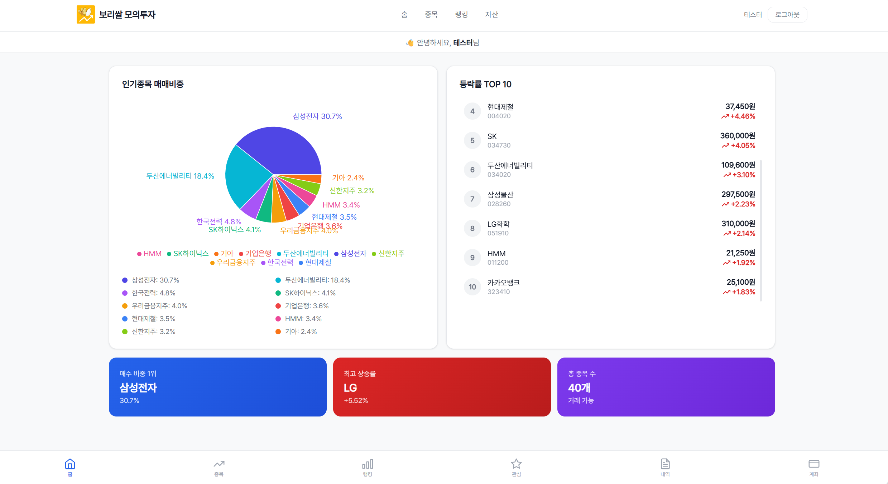
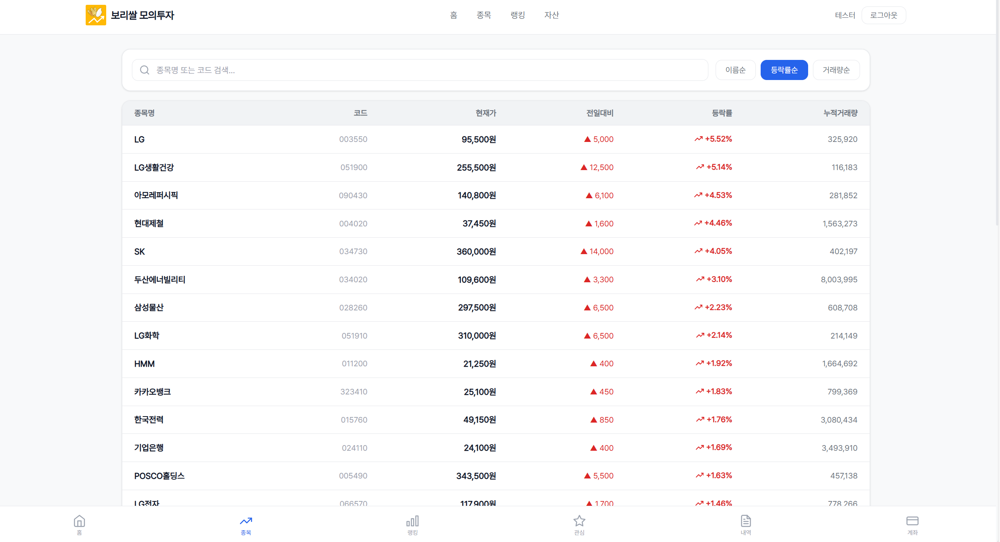
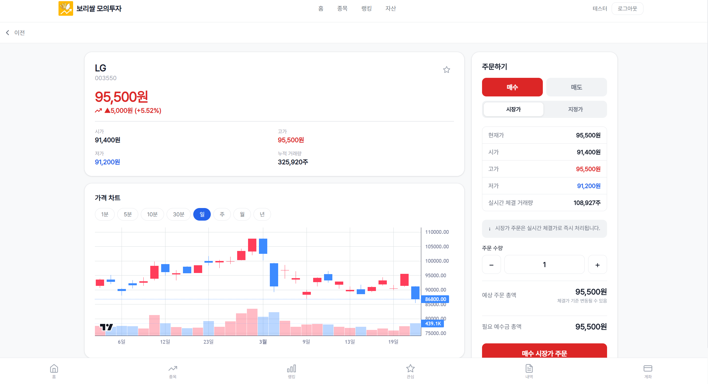
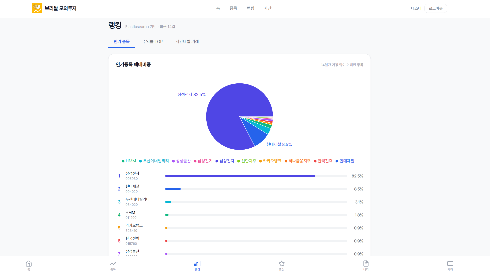

# 🌾 Barleyssal — React Frontend

> **모의 주식 거래 플랫폼**의 프론트엔드 SPA(Single Page Application)입니다.  
> 실시간 WebSocket 시세를 기반으로 주식 검색, 주문, PNL 결과를 제공하며  
> 대시보드와 통계 차트도 포함합니다.

<br/>

## 📌 관련 레포지토리

| 서버             | 역할                                  | 링크                                                                |
| ---------------- | ------------------------------------- | ------------------------------------------------------------------- |
| **Spring Boot**  | 메인 비즈니스 로직 API 서버           | [barleyssal-spring](https://github.com/hkmin3827/barleyssal-spring) |
| **Go**           | 실시간 시세·호가·주문 매칭 게이트웨이 | [barleyssal-go](https://github.com/hkmin3827/barleyssal-go)         |
| **React** (현재) | 프론트엔드 SPA                        | —                                                                   |

<br/>

<br/>

## Vercel 페이지

[⭐ Barleyssal 홈페이지 바로 가기](https://barleyssal.vercel.app/)

#### ⚠️ 현재, 배포과정에서 비용 문제로 k3s 기반 전체 배포가 중단되었습니다.

#### ⚠️ Docker-compose ▷ Go와 Redis만 AWS EC2f로 배포 진행되었으니 홈페이지와 종목 탭의 종목리스트, 종목 상세페이지만 이용가능합니다.

#### ⚠️ 종목 상세의 1/5/10/30분봉의 분봉 차트는 내부 Redis 저장 데이터로 자체적으로 그리고 있으니, 4/7기준 재배포로 데이터가 없을 수 있습니다.


#### 🚫 로그인, 회원가입 등 인증 & 관심종목 페이지, 엘라스틱서치 기반 랭킹 탭은 이용 불가하니 양해 부탁드립니다.

<br/>

## 🛠️ 기술 스택

| 분류        | 기술                                  |
| ----------- | ------------------------------------- |
| Language    | JavaScript (ES2022+)                  |
| Framework   | React 19                              |
| Build Tool  | Vite                                  |
| Routing     | React Router v7                       |
| 상태 관리   | Zustand (+ persist 미들웨어)          |
| HTTP Client | Axios                                 |
| 실시간 통신 | WebSocket (Native API, 싱글톤 커넥션) |
| 차트        | Lightweight Charts (캔들스틱)         |
| 스타일      | CSS Modules                           |
| 배포        | Vercel                                |

<br/>

## 📂 프로젝트 구조

```
src/
├── api/
│   ├── springApi.js       # Spring Boot REST API 호출 (Axios, CSRF 자동 처리)
│   └── goApi.js           # Go Market Gateway REST API 호출
├── store/
│   ├── authStore.js       # 인증 상태 (user, isLoggedIn)
│   ├── marketStore.js     # 실시간 시세·종목 데이터
│   ├── watchlistStore.js  # 관심종목 목록
│   └── toastStore.js      # 전역 토스트 알림
├── hooks/
│   └── useWebSocket.js    # WebSocket 싱글톤 관리 훅
├── pages/
│   ├── HomePage.jsx
│   ├── LoginPage.jsx
│   ├── ResetPasswordPage.jsx
│   ├── StocksPage.jsx
│   ├── StockDetailPage.jsx
│   ├── WatchlistPage.jsx
│   ├── AccountPage.jsx
│   ├── TradeHistoryPage.jsx
│   ├── RankingPage.jsx
│   ├── AdminUserPage.jsx
│   └── AdminChartPage.jsx
├── components/
│   ├── layout/
│   │   ├── TopBar.jsx
│   │   └── BottomNav.jsx
│   ├── chart/
│   │   └── CandleChart.jsx
│   ├── order/
│   │   └── OrderPanel.jsx
│   ├── account/
│   │   └── HoldingCard.jsx
│   ├── stats/
│   │   └── AdminCharts.jsx
│   ├── admin/
│   │   └── AdminLayout.jsx
│   └── toast/
│       └── toast.jsx
├── constants/
│   └── stocks.js
├── utils/
│   └── format.js
├── App.jsx
└── main.jsx        # Vite 앱 진입점
```

<br/>

## 🗺️ 페이지 구성 및 라우팅

| 경로              | 컴포넌트            | 인증 필요 | 설명                                               |
| ----------------- | ------------------- | :-------: | -------------------------------------------------- |
| `/`               | `HomePage`          |    ❌     | 홈 — 등락률·거래량 Top10 실시간 랭킹               |
| `/login`          | `LoginPage`         |    ❌     | 로그인 / 회원가입                                  |
| `/reset-password` | `ResetPasswordPage` |    ❌     | 비밀번호 재설정                                    |
| `/stocks`         | `StocksPage`        |    ❌     | 전체 종목 목록 (이름·등락률·거래량 정렬)           |
| `/ranking`        | `RankingPage`       |    ❌     | 실시간 주가 등락률·거래량 랭킹                     |
| `/stock/:code`    | `StockDetailPage`   |    ❌     | 종목 상세 — 실시간 시세, 캔들차트, 주문            |
| `/watchlist`      | `WatchlistPage`     |    ✅     | 관심종목 목록 및 삭제                              |
| `/account`        | `AccountPage`       |    ✅     | 계좌 잔고·보유종목·손익 현황                       |
| `/trades`         | `TradeHistoryPage`  |    ✅     | 주문 체결 내역                                     |
| `/admin`          | `AdminUserPage`     | ✅ Admin  | 회원 목록·상세·활성화/비활성화                     |
| `/admin/chart`    | `AdminChartPage`    | ✅ Admin  | 거래 통계 시각화 (수익률·인기종목·시간대별 거래량) |

**라우팅 가드**

```jsx
// 비로그인 → /login 리다이렉트
// 비관리자 → / 리다이렉트
<ProtectedRoute adminOnly>
  <AdminUserPage />
</ProtectedRoute>
```

<br/>

## ⚙️ 상태 관리

### Zustand 스토어 구조

```
authStore        → 로그인 상태 (localStorage 영속화)
  ├── user       (id, email, userName, role)
  └── isLoggedIn

marketStore      → 실시간 시세 데이터
  ├── prices     { [stockCode]: { price, changeRate, ... } }
  └── topRanking { topChangeRate: [], topBuyVolume: [] }

watchlistStore   → 관심종목 목록
  └── items      [{ stockCode, stockName }]

toastStore       → 전역 토스트 알림 큐
  └── toasts     [{ id, message, type }]
```

<br/>

## 🔌 WebSocket 연동 (`useWebSocket.js`)

앱 전역에서 **단 하나의 WebSocket 커넥션**을 공유합니다.

```
연결 흐름:
  컴포넌트 마운트 → refCount++ → ws 없으면 connect()
  컴포넌트 언마운트 → refCount-- → 0이면 close()

자동 재연결:
  연결 끊김 감지 → 3초 후 재시도

Auth 전송:
  로그인 상태이면 연결 직후 { type: "auth", userId } 전송

Ping:
  30초마다 { type: "ping" } 전송으로 커넥션 유지

서버 Push 처리 (marketStore 자동 업데이트):
  price_update  → marketStore.prices 업데이트
  home_update   → marketStore.topRanking 업데이트
  order_executed → 체결 토스트 알림 표시
  pnl_update    → 계좌 PnL 갱신
```

<br/>

## 🔒 CSRF 처리

Spring Boot와의 API 통신에서 CSRF 토큰을 자동으로 처리합니다.

```javascript
// 최초 앱 로드 시: GET /api/v1/auth/csrf 로 쿠키 발급
// 이후 POST/PUT/PATCH/DELETE 요청: X-XSRF-TOKEN 헤더 자동 첨부
spring.interceptors.request.use(async (config) => {
  if (isMutating) {
    await ensureCsrfToken();
    config.headers["X-XSRF-TOKEN"] = getCookie("XSRF-TOKEN");
  }
  return config;
});
```

<br/>

## 📱 주요 기능 화면 요약

| 화면          | 주요 기능                                                        |
| ------------- | ---------------------------------------------------------------- |
| **홈**        | WebSocket으로 5초마다 갱신되는 등락률·거래량 Top10 실시간 표시   |
| **종목 상세** | 실시간 시세, 지정가/시장가 매수·매도 주문, D/W/M/Y·분봉 캔들차트 |
| **계좌**      | 총 자산·예수금·보유종목·평가손익·수익률 표시, 원금 설정          |
| **주문 내역** | PENDING→FILLED 상태별 주문 목록, 미체결 주문 취소                |
| **관심종목**  | 종목 추가/삭제, 현재가 실시간 표시                               |
| **랭킹**      | 등락률·거래량 기준 실시간 종목 순위                              |
| **관리자**    | 회원 목록 페이징·검색, 활성화/비활성화, 거래 통계 차트           |

---

## 📱 UI images

[HomePage]


[StocksPage]


[StockDetailPage]


[RankingPage - 인기 매매 종목]


[AccountPage - pnl]

